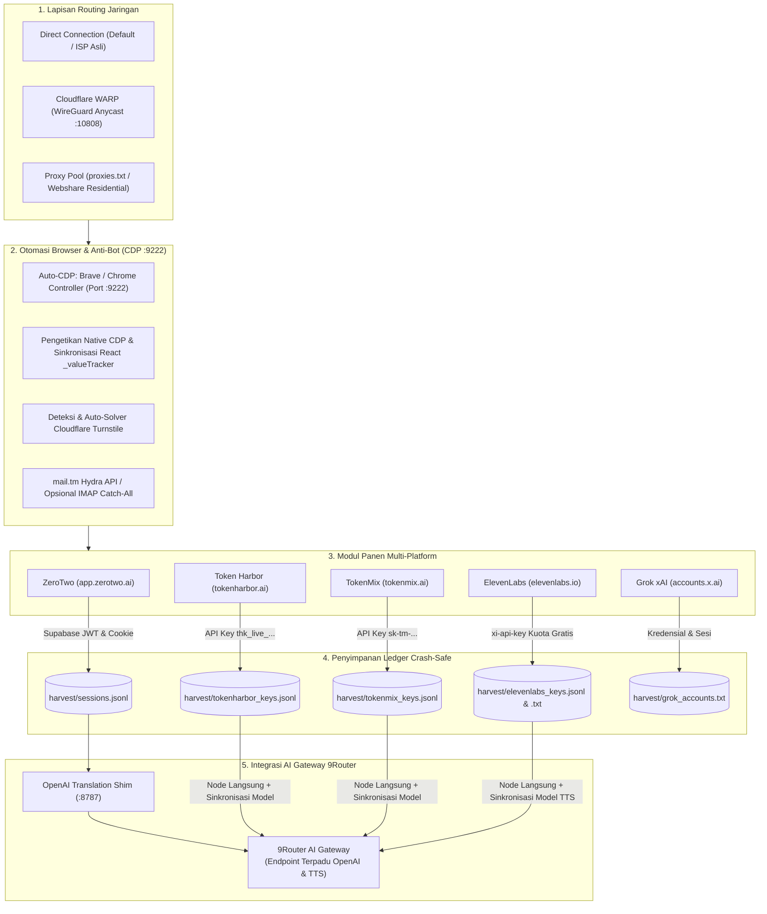

<div align="center">

# llm-harvester

**Pembuat akun AI multi-platform & token harvester · ZeroTwo, Token Harbor & TokenMix · koneksi otomatis 9Router**

[](https://python.org)
[](LICENSE)
[](https://9router.com)
[](#)
[](https://app.zerotwo.ai)
[](#)

*Buat akun AI massal via mail.tm, ambil sesi JWT, cookie, atau API key dari ZeroTwo, Token Harbor, dan TokenMix, lalu hubungkan ke [9Router](https://9router.com) sebagai provider yang kompatibel dengan OpenAI — dari awal sampai akhir.*

[English](../README.md) · [Bahasa Indonesia](README.id.md) · [Español](README.es.md) · [日本語](README.ja.md) · [中文](README.zh.md) · [Français](README.fr.md)

</div>

---

## Apa yang dilakukannya

1. **Multi-Target Farming**: Mendukung **ZeroTwo** (`app.zerotwo.ai`), **Token Harbor** (`tokenharbor.ai`), **TokenMix** (`api.tokenmix.ai`), **ElevenLabs** (`elevenlabs.io`), dan **Grok xAI** (`accounts.x.ai`) dengan menu interaktif atau flag CLI langsung.
2. **Dashboard Interaktif TUI (`./main.py`)**: Antarmuka terminal interaktif lengkap dengan diagnosis kesiapan sistem, tabel status real-time, dan menu eksekusi satu klik pada 7 modul utama.
3. **Pilihan Routing Jaringan Fleksibel (Direct secara Default)**:
   - **Direct Connection (Default)**: Menggunakan koneksi ISP residensial lokal langsung tanpa proxy, memberikan skor reputasi manusia tertinggi di Cloudflare Turnstile.
   - **Cloudflare WARP (`:10808`)**: Generator akun WireGuard otomatis via REST API resmi Cloudflare dan daemon proxy lokal `sing-box` untuk IP anycast Cloudflare yang bersih (`hosting: false`).
   - **Proxy Pool**: Rotasi IP otomatis via `proxies.txt` atau proxy residensial Webshare saat melakukan panen dalam jumlah besar.
4. **Webshare Residential Hunter**: Modul pencari proxy residensial otomatis berbasis AI audio captcha solver (Google SpeechRecognition / CapSolver).
5. **Otomasi CDP & Anti-Bot Handal**:
   - Pengetikan native CDP (`Input.insertText`) + Sinkronisasi `_valueTracker` React untuk mencegah nilai form kosong pada form Next.js / React.
   - Deteksi dan penyelesaian otomatis tantangan Cloudflare Turnstile.
   - Penyesuaian mode tampilan otomatis (jendela browser terlihat saat Turnstile aktif).
6. **Panen Kredensial & Integrasi Otomatis 9Router**:
   - **Token Harbor**: Mengambil API key dashboard (`thk_live_...`), menyinkronkan 20+ model ID, dan otomatis terdaftar sebagai provider node OpenAI di **9Router**.
   - **TokenMix**: Mengambil API key dashboard (`sk-tm-...`), menyinkronkan 22+ model ID, dan otomatis terdaftar sebagai provider node OpenAI di **9Router**.
   - **ElevenLabs**: Menghasilkan `xi-api-key` (10.000 karakter kuota gratis), bypass onboarding wizard, verifikasi email via `mail.tm` atau IMAP catch-all, serta sinkronisasi model suara TTS ke **9Router**.
   - **ZeroTwo**: Mengambil JWT Supabase, cookie (`cf_clearance`, `__csrf`), token CSRF, dan terhubung ke **9Router** via OpenAI shim lokal.
   - **Grok xAI**: Otomasi pembuatan akun dengan rotasi proxy residensial dan auto-OTP.
7. **Output Ledger Crash-Safe**: Menyimpan seluruh hasil panen ke berkas JSONL append-only (`sessions.jsonl`, `tokenharbor_keys.jsonl`, `tokenmix_keys.jsonl`, `elevenlabs_keys.jsonl`, `elevenlabs_keys.txt`, `grok_accounts.txt`).

## Arsitektur

```text
┌─────────────────────────────────────────────────────────────────────────────────────────────────────────────────┐
│                                           Arsitektur llm-harvester                                              │
└─────────────────────────────────────────────────────────────────────────────────────────────────────────────────┘

   ┌───────────────────────────────────────────────────────────────────────────────────────────────────────────┐
   │                                           LAPISAN ROUTING JARINGAN                                        │
   │  [1] Direct Connection (Default)  │  [2] Cloudflare WARP (:10808)  │  [3] Proxy Pool (Webshare/Residensial)│
   └─────────────────────────────────────┬─────────────────────────────────────────────────────────────────────┘
                                         │ Mengarahkan Traffic Jaringan Browser & HTTP
                                         ▼
   ┌───────────────────────────────────────────────────────────────────────────────────────────────────────────┐
   │                                     OTOMASI BROWSER & IDENTITAS (CDP :9222)                               │
   │  • Auto-CDP: Browser Brave / Chromium / Chrome (Port :9222, otomatis tanpa start-browser.sh)              │
   │  • Pengetikan Native CDP (`Input.insertText`) + Sinkronisasi State React `_valueTracker`                  │
   │  • Deteksi & Auto-Solver Cloudflare Turnstile                                                             │
   │  • mail.tm Hydra REST API & Listener Opsional IMAP Catch-All                                              │
   └─────────────────────────────────────┬─────────────────────────────────────────────────────────────────────┘
                                         │ Mengorkestrasi Registrasi Akun
                                         ▼
   ┌───────────────────────────────────────────────────────────────────────────────────────────────────────────┐
   │                                      MODUL PANEN MULTI-PLATFORM                                           │
   │  ┌──────────────────┐ ┌──────────────────┐ ┌──────────────────┐ ┌──────────────────┐ ┌──────────────────┐  │
   │  │  ZeroTwoCreator  │ │TokenHarborCreator│ │ TokenMixCreator  │ │ElevenLabsCreator │ │   GrokCreator    │  │
   │  │ (app.zerotwo.ai) │ │ (tokenharbor.ai) │ │  (tokenmix.ai)   │ │ (elevenlabs.io)  │ │ (accounts.x.ai)  │  │
   │  └────────┬─────────┘ └────────┬─────────┘ └────────┬─────────┘ └────────┬─────────┘ └────────┬─────────┘  │
   └───────────┼────────────────────┼────────────────────┼────────────────────┼────────────────────┼────────────┘
               │                    │                    │                    │                    │
               │ Supabase JWT,      │ API Key Dashboard  │ API Key Dashboard  │ xi-api-key (10k    │ Token Sesi &
               │ Cookie & Token CSRF│ (thk_live_...)     │ (sk-tm-...)        │ karakter gratis)   │ Kredensial Auth
               ▼                    ▼                    ▼                    ▼                    ▼
   ┌──────────────────────┐ ┌──────────────────┐ ┌──────────────────┐ ┌──────────────────┐ ┌──────────────────┐
   │ harvest/             │ │ harvest/         │ │ harvest/         │ │ harvest/         │ │ harvest/         │
   │ sessions.jsonl       │ │ tokenharbor_keys │ │ tokenmix_keys    │ │ elevenlabs_keys  │ │ grok_accounts.txt│
   └───────────┬──────────┘ └────────┬─────────┘ └────────┬─────────┘ └────────┬─────────┘ └──────────────────┘
               │                     │                    │                    │
               │ Local SSE Shim      │ Node Langsung &    │ Node Langsung &    │ Node Provider TTS
               │ (:8787)             │ Sinkronisasi Mod.  │ Sinkronisasi Mod.  │ & Sinkronisasi Mod.
               ▼                     ▼                    ▼                    ▼
   ┌───────────────────────────────────────────────────────────────────────────────────────────────────────────┐
   │                                            AI GATEWAY 9Router                                             │
   │                          (Load Balancing Multi-Akun & Endpoint Tunggal AI Terpadu)                        │
   └───────────────────────────────────────────────────────────────────────────────────────────────────────────┘
```



### Penjelasan Alur Arsitektur

1. **Lapisan Routing Jaringan**:  
   - **Direct Connection (Default)**: Koneksi langsung tanpa proxy. Sangat ideal untuk lolos Turnstile karena memakai skor reputasi manusia tertinggi dari ISP asli.
   - **Cloudflare WARP (`:10808`)**: Membuat profil WireGuard via REST API resmi Cloudflare dan merouting traffic melalui daemon proxy lokal `sing-box`.
   - **Proxy Pool**: Merotasi IP keluar menggunakan proxy HTTP/SOCKS5 terotentikasi dari `proxies.txt` atau Webshare Residential.

2. **Otomasi Browser via CDP (`:9222`)**:  
   Mengendalikan browser asli (Chromium, Google Chrome, atau Brave) via protokol **Chrome DevTools Protocol (CDP)** pada port 9222. Dilengkapi pengetikan native `Input.insertText` dan sinkronisasi `_valueTracker` React agar state form Next.js tidak ter-reset, serta menyelesaikan tantangan Cloudflare Turnstile secara otomatis.

3. **Email Sementara Sekali Pakai (`mail.tm`)**:  
   Secara otomatis membuat kotak email sementara sesuai kebutuhan via REST API `mail.tm` (`POST /accounts`). Email ini digunakan untuk menerima link verifikasi (ZeroTwo & Token Harbor) maupun kode OTP (TokenMix) tanpa memerlukan tab webmail terpisah.

4. **Creator Multi-Platform**:  
   - **`ZeroTwoCreator`**: Mendaftar di `app.zerotwo.ai`, membuka magic link, menyelesaikan wizard onboarding, lalu menyadap token Supabase JWT (`access_token`, `refresh_token`), cookie (`cf_clearance`, `__csrf`), dan token CSRF.
   - **`TokenHarborCreator`**: Mendaftar di `tokenharbor.ai`, memverifikasi email, membuka halaman manajemen API key, lalu mengekstrak API key produksi (`thk_live_...`).
   - **`TokenMixCreator`**: Mendaftar di `tokenmix.ai`, menyelesaikan verifikasi Turnstile, memverifikasi email, lalu mengekstrak API key (`sk-tm-...`).
   - **`GrokCreator`**: Mendaftar akun di `accounts.x.ai` dengan rotasi proxy residensial.

5. **Penyimpanan Ledger Terpisah**:  
   Menyimpan seluruh kredensial hasil panen ke berkas ledger JSONL yang *append-only* dan *crash-safe*:
   - `harvest/sessions.jsonl` (Sesi ZeroTwo)
   - `harvest/tokenharbor_keys.jsonl` (API key Token Harbor)
   - `harvest/tokenmix_keys.jsonl` (API key TokenMix)
   - `harvest/grok_accounts.txt` (Akun Grok)

6. **Integrasi Langsung 9Router & Sinkronisasi Model**:  
   - **ZeroTwo**: Mendaftarkan node OpenAI yang diarahkan ke shim lokal (`http://localhost:8787/v1`) dan memetakan model eksklusif ZeroTwo (`gpt-6-luna`, `deepseek-v4.1-flash`, dll.).
   - **Token Harbor**: Langsung membuat node OpenAI di 9Router (`https://tokenharbor.ai/v1`), menghubungkan API key hasil panen, dan otomatis mendaftarkan 20+ model (`claude-opus-5.5`, `gpt-6-astra`, `deepseek-v3`, dll.).
   - **TokenMix**: Langsung membuat node OpenAI di 9Router (`https://api.tokenmix.ai/v1`), menghubungkan API key hasil panen, dan otomatis mendaftarkan 22+ model (`gpt-4o`, `deepseek-v4`, `gemini-2.5-flash`, dll.).


## Instalasi

```bash
git clone https://github.com/Hazz-i/llm-harvester.git
cd llm-harvester
pip install -e ".[shim]"
```

## Mulai Cepat

### 1. Browser CDP (Otomatis Dijalankan)

`llm-harvester` secara otomatis mendeteksi dan menjalankan Chromium, Google Chrome, atau Brave Browser lokal Anda dengan mode remote debugging aktif pada port `9222`. Anda **tidak** perlu menjalankan skrip peluncur manual atau menyalin URL websocket secara manual.

Jika Anda ingin menjalankan browser secara manual terlebih dahulu:

```bash
# Brave Browser
brave-browser --remote-debugging-port=9222 --user-data-dir=./chrome-data

# Atau Google Chrome
google-chrome --remote-debugging-port=9222 --user-data-dir=./chrome-data
```

*(Catatan: `llm-harvester` secara otomatis mendeteksi browser aktif pada port 9222 dan memperbarui `.env` secara dinamis!)*

### 2. Konfigurasi `.env` atau `config.toml`

Salin `.env.example` ke `.env`:

```bash
cp .env.example .env
```

#### A. Konfigurasi Umum (Token Harbor, TokenMix, ElevenLabs & ZeroTwo)
Pengaturan ini digunakan untuk semua platform:

```env
# Browser CDP (Otomatis dideteksi & dijalankan di port 9222; hanya diset untuk remote/cloud CDP)
# LLM_CDP_WS=ws://127.0.0.1:9222/devtools/browser/<id>

# AI Gateway 9Router (Bisa lokal http://localhost:20128 atau remote https://nine.domainanda.com)
NINEROUTER_URL=https://nine.hazz.biz.id
NINEROUTER_API_KEY=sk_...
# Jika dashboard 9Router Anda diproteksi password:
NINEROUTER_PASSWORD=password_dasbor_anda
```

> [!TIP]
> **Farming Token Harbor, TokenMix, atau ElevenLabs?**  
> Cukup konfigurasi di atas! Ketiga platform ini menghasilkan API key mandiri (`thk_live_...`, `sk-tm-...`, dan `xi-api-key`) dan langsung terhubung ke cloud upstream. **Tidak memerlukan VPS, tidak memerlukan shim lokal, dan tidak membutuhkan port 8787.** Anda bisa langsung mulai farming di komputer lokal!
> Untuk ElevenLabs, verifikasi email otomatis menggunakan `mail.tm` secara default, atau Anda dapat mengatur `IMAP_USER`, `IMAP_PASSWORD`, dan `IMAP_ENABLED=true` pada `.env` jika menggunakan domain catch-all kustom.

#### B. Konfigurasi Khusus ZeroTwo (Memerlukan Shim & Opsi VPS)
Karena ZeroTwo menggunakan session JWT Supabase dan cookie sesi (bukan API key standar), dibutuhkan shim penerjemah OpenAI (`:8787`):

```env
# Base URL shim ZeroTwo (laptop lokal: http://127.0.0.1:8787/v1)
LLM_SHIM_BASE_URL=http://localhost:8787/v1

# Opsional: Jika menjalankan 9Router & Shim 24/7 di VPS remote (Skenario B)
# LLM_REMOTE_SYNC=user@ip-vps:/opt/llm-harvester/harvest/sessions.jsonl
```

*(Catatan: File `.env` atau `config.toml` otomatis dimuat oleh `llm-harvester`)*.

### 3. Buat dan Panen Akun

#### A. Menu Interaktif TUI (`./main.py`)
Jalankan dashboard terminal:
```bash
./main.py
```
Atau prompt interaktif CLI:
```bash
llm-harvester run
```
```text
Pilih target farming:
  [1] ZeroTwo      (app.zerotwo.ai)    -> JWT Session, Cookies, 9Router
  [2] Token Harbor (tokenharbor.ai)    -> API Key (thk_live_...), mail.tm
  [3] TokenMix     (tokenmix.ai)       -> API Key (sk-tm-...), mail.tm
  [4] ElevenLabs   (elevenlabs.io)     -> API Key (xi-api-key), mail.tm / IMAP
Pilihan [1-4] (default 1):
```

#### B. Langsung via Flag Target
```bash
# Panen 5 akun Token Harbor (API key langsung -> 9Router + sinkronisasi model)
llm-harvester run --target tokenharbor --count 5

# Panen 3 akun TokenMix (API key langsung -> 9Router + sinkronisasi model)
llm-harvester run --target tokenmix --count 3

# Panen 2 akun ElevenLabs (10.000 karakter gratis per akun -> 9Router + model TTS)
llm-harvester run --target elevenlabs --count 2

# Panen 2 akun ZeroTwo (sesi -> 9Router via shim)
llm-harvester run --target zerotwo --count 2
```

*(Catatan: Alias `zt-harvester` tetap tersedia).*

### 4. Jalankan shim kompatibel OpenAI (Khusus ZeroTwo)

> [!NOTE]
> **Hanya untuk ZeroTwo!** Token Harbor dan TokenMix terhubung langsung ke endpoint publik mereka dan otomatis terdaftar ke 9Router tanpa shim lokal. Jalankan shim hanya jika Anda memanen atau menggunakan **ZeroTwo**.

Jalankan shim lokal (otomatis membaca cookie & CSRF token terbaru dari `harvest/sessions.jsonl`):

```bash
llm-harvester shim --port 8787
```

---

## Arsitektur ZeroTwo: Mesin Lokal vs Server VPS

> [!IMPORTANT]
> **Bagian ini KHUSUS untuk ZeroTwo!**
> - **Token Harbor & TokenMix** berjalan 100% mandiri di komputer lokal tanpa memerlukan server VPS atau shim.
> - **ZeroTwo** memerlukan skenario di bawah ini karena mengandalkan sesi JWT & cookie Supabase yang harus diterjemahkan lewat OpenAI shim (`:8787`).

Anda bisa menjalankan **ZeroTwo** dalam dua skenario utama:

### Skenario A: 1 Mesin (Single-Machine / Komputer Laptop) — Tanpa VPS!

Jika Anda ingin menjalankan seluruh sistem di **laptop lokal** tanpa repot mengelola VPS:
> **Anda TIDAK PERLU melakukan upload/SCP/push ke server sama sekali!** Seluruh file dibaca dan ditulis langsung di mesin lokal tersebut.

- **9Router**: Berjalan lokal (`http://localhost:20128`)
- **Shim**: Berjalan lokal (`http://localhost:8787`)
- **Harvester**: Berjalan lokal di laptop yang sama

**Konfigurasi (`.env` di laptop):**
```env
NINEROUTER_URL=http://localhost:20128
NINEROUTER_API_KEY=sk_9router
LLM_SHIM_BASE_URL=http://127.0.0.1:8787/v1
```

**Alur Langkah-demi-Langkah:**
1. Jalankan 9Router lokal Anda.
2. Jalankan ZeroTwo shim (via terminal atau PM2):
   ```bash
   llm-harvester shim --port 8787
   # atau via PM2:
   pm2 start "llm-harvester shim --port 8787" --name zt-shim
   ```
3. Di dasbor 9Router lokal, Base URL node ZeroTwo diatur ke:
   ```text
   http://127.0.0.1:8787/v1
   ```
4. Buka browser dengan CDP:
   ```bash
   google-chrome --remote-debugging-port=9222 --user-data-dir=./chrome-data
   ```
5. Jalankan panen:
   ```bash
   llm-harvester run --target zerotwo -n 2
   ```
   *Akun langsung dibuat, tersimpan di `harvest/sessions.jsonl`, dan otomatis terdaftar ke 9Router lokal Anda. Tanpa VPS, tanpa SCP!*

---

### Skenario B: 2 Mesin (Laptop Harvester + Server VPS 24/7)

Gunakan skenario ini untuk memanfaatkan **koneksi internet rumahan laptop Anda** (agar mudah lolos verifikasi bot Cloudflare Turnstile tanpa proxy datacenter yang terblokir), sementara **ZeroTwo shim & 9Router tetap online 24/7 di VPS**:

- **Laptop**: Chrome CDP + Harvester.
- **VPS**: 9Router + ZeroTwo Shim (dikelola oleh systemd atau PM2).
- **Auto-Sync**: Begitu selesai panen di laptop, file `sessions.jsonl` otomatis terkirim via SCP ke VPS dan kredensial langsung terhubung ke 9Router.

**Konfigurasi di Laptop (`.env`):**
```env
NINEROUTER_URL=https://nine.domainanda.com
NINEROUTER_API_KEY=sk_...
NINEROUTER_PASSWORD=password_dasbor_anda
LLM_SHIM_BASE_URL=http://127.0.0.1:8787/v1
LLM_REMOTE_SYNC=user@ip-vps:/opt/llm-harvester/harvest/sessions.jsonl
```

**Alur Langkah-demi-Langkah:**
1. Di VPS, jalankan shim 24/7 menggunakan systemd atau PM2 (lihat panduan di bawah).
2. Di dasbor 9Router VPS Anda, atur Base URL node `zerotwo` ke:
   ```text
   http://127.0.0.1:8787/v1
   ```
3. Kapan pun Anda ingin panen akun baru di laptop:
   ```bash
   llm-harvester run --target zerotwo -n 2
   ```
   *Harvester akan membuat akun, mendaftarkannya ke 9Router via API, dan otomatis mengirim file `sessions.jsonl` ke VPS Anda.*

---

### Mengelola Shim dengan `systemd` atau `pm2`

#### Opsi 1: Menjalankan dengan `systemd` (Rekomendasi Linux VPS)

Buat file unit service `/etc/systemd/system/zt-shim.service`:

```ini
[Unit]
Description=ZeroTwo OpenAI Shim Service
After=network.target

[Service]
Type=simple
User=ubuntu
WorkingDirectory=/opt/llm-harvester
ExecStart=/opt/llm-harvester/.venv/bin/llm-harvester shim --port 8787
Restart=always
RestartSec=5
EnvironmentFile=/opt/llm-harvester/.env

[Install]
WantedBy=multi-user.target
```

Perintah:
```bash
sudo systemctl daemon-reload
sudo systemctl enable --now zt-shim
sudo systemctl status zt-shim
sudo journalctl -u zt-shim -f
```

#### Opsi 2: Menjalankan dengan `pm2` (Lokal atau VPS)

```bash
cd /path/to/llm-harvester

# Jalankan dengan PM2
pm2 start "llm-harvester shim --port 8787" --name zt-shim

# Otomatis hidup saat sistem reboot
pm2 save
pm2 startup

# Cek status dan log
pm2 status
pm2 logs zt-shim
```

---

## Referensi Perintah CLI

*(Catatan: Perintah `zt-harvester` tetap didukung sebagai alias)*.

| Perintah | Fungsi |
| --- | --- |
| `./main.py` | Buka Dashboard Interaktif TUI (Diagnosis sistem, 1-klik panen, WARP & proxy) |
| `llm-harvester run` | Menu interaktif untuk memilih target (ZeroTwo, Token Harbor, TokenMix, Grok xAI) |
| `llm-harvester run -t tokenharbor --direct` | Panen Token Harbor via Direct Connection (ISP asli tanpa proxy, default) |
| `llm-harvester run -t tokenharbor --warp` | Panen Token Harbor dengan traffic dialihkan lewat Cloudflare WARP (:10808) |
| `llm-harvester run -t tokenharbor --proxy-file proxies.txt` | Panen Token Harbor dengan rotasi pool proxy |
| `llm-harvester run -t tokenharbor -n 5` | Panen 5 akun Token Harbor & push API key + model ke 9Router |
| `llm-harvester run -t tokenmix -n 3` | Panen 3 akun TokenMix & push API key + model ke 9Router |
| `llm-harvester run -t zerotwo -n 2` | Panen 2 akun ZeroTwo & hubungkan ke 9Router via shim |
| `llm-harvester run -t zerotwo -n 5 -s user@vps:...` | Panen ZeroTwo dan otomatis upload ledger via SCP ke VPS remote |
| `llm-harvester warp status` | Cek status daemon proxy Cloudflare WARP lokal (:10808) |
| `llm-harvester warp start` | Jalankan daemon sing-box WARP di port 10808 |
| `llm-harvester warp stop` | Hentikan daemon sing-box WARP |
| `llm-harvester warp register` | Daftarkan profil WireGuard Cloudflare WARP baru via API REST resmi |
| `llm-harvester shim -p 8787` | Jalankan shim ZeroTwo kompatibel OpenAI |
| `llm-harvester sync --target all` | Sinkronisasi seluruh sesi & API key aktif langsung ke 9Router |
| `llm-harvester proxies --check` | Daftar & uji pool proxy |
| `llm-harvester export -f csv` | Ekspor ledger panen |

## Pool Proxy

Sebarkan batas rate per-IP dengan memutar IP keluar tiap akun. Pool menerima format umum `host:port:user:pass`.

```bash
# langsung via flag
llm-harvester run -n 10 --proxy "31.59.20.176:6754:user:pass" --proxy "45.38.107.97:6014:user:pass"

# via berkas
llm-harvester run -n 10 --proxy-file proxies.txt
llm-harvester proxies --proxy-file proxies.txt --check
```

## API Python

```python
import asyncio
from ztharvester import Harvester, HarvesterConfig

cfg = HarvesterConfig.from_env()
cfg.browser.cdp_ws = "ws://127.0.0.1:9222/devtools/browser/<id>"
cfg.router.shim_base_url = "http://localhost:8787/v1"
asyncio.run(Harvester(cfg).run(count=10))
```

## Konfigurasi

Salin `config.example.toml` dan `.env.example`:

```bash
cp config.example.toml config.toml
cp .env.example .env
llm-harvester run -n 3 --config config.toml
```

Semua kolom terdokumentasi langsung di dalam `config.example.toml`.

## Pengujian

```bash
pip install -e ".[dev]"
pytest -q
```

## Struktur proyek

```
src/ztharvester/
  mail.py      Klien email sekali pakai kompatibel mail.tm
  zerotwo.py   Driver pendaftaran / magic-link / onboarding + harvester
  cdp.py       Adapter CDP (websocket lokal, bridge dalam proses, cloud)
  router9.py   Klien API manajemen provider 9Router
  shim.py      Jembatan protokol OpenAI-kompatibel <-> ZeroTwo
  engine.py    Orkestrasi konkuren + ledger JSONL yang dapat dilanjutkan
  config.py    Model konfigurasi
  cli.py       Antarmuka baris perintah
tests/
docs/          6 translated READMEs
assets/        logo
```

## Kebutuhan

- Python 3.10+
- Chromium yang dapat diakses via CDP (port debug lokal atau browser cloud)
- Instance [9Router](https://9router.com) yang berjalan (default `http://localhost:20128`)

## Catatan

- Edge ZeroTwo memerlukan cookie `cf_clearance` dan token CSRF selain JWT; ekspor keduanya ke shim sekali saja.
- Shim menjalankan satu proses yang melayani setiap akun hasil panen — JWT dibaca per permintaan dari `Authorization`.
- Gunakan secara bertanggung jawab dan hanya pada akun yang sah Anda buat.
- Ratelimit per-IP/per-alamat berlaku di ZeroTwo dan mail.tm. Jaga `--concurrency` tetap rendah (1–2), beri jeda, dan biarkan retry menangani `429` sementara.

## License

MIT — lihat [LICENSE](LICENSE).

<div align="center"><sub>Dibuat untuk ekosistem 9Router · tidak berafiliasi dengan ZeroTwo atau 9Router</sub></div>
